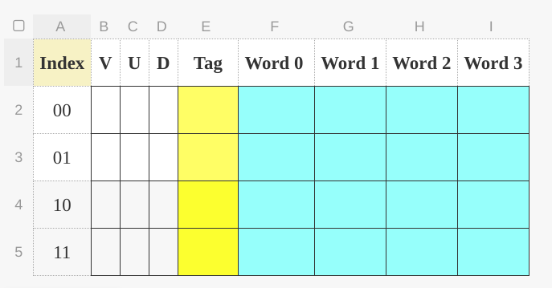

## Cache

**Input**: 

From CPU:

1.  **1'b** read/write
2.  **10'b** address
3.  **32'b** Write Data

From Main Memory:

1. **128'b** Read Data


**Output**:

To CPU:

1. **32'b** Read Data
2.  **1'b** hit/miss

To Main Memory:

1. **1'b** read/write

2. **10'b** Address

3. **128'b** Write Data

   

**Structure**:

+ 4-block cache

+ 4 words per block (16 bytes / block)

+ assuming 10-bit addresses

  

**Directed Mapped:**

Data Address:

cache structure:

 

3+1(no use)+4+4*32 = 136 bits / row

4*136 = 544 bits / cache

​	

**2-Way associative:**

Data Address:

A9 A8 A7 A6 A5 **A4** A3 A2 A1 A0

​	A1-A0: Word offset 

​	A3-A2: Block offset

​	A4: Way Index

​	A9-A5: Tag (5 bits)

E.g:

mem addr: 1 0 1 1 0 1 0 1 0 0

word addr: 1 0 1 1 0 1 0 1

cache structure:


3+5+4*32 = 136 bits / row

4*136 = 544 bits / cache


## Basic Algorithm

```tex
while CPU sends address & read_write{
	if (hit){
		CPU reads/writes the cache;
	}
	else if (miss){
		cache sends 10'b address to the main memory;
		cache request the missing block from the main memory;(assume no miss here)
		CPU sends the same address from cache;
		CPU reads/writes the cache;
	}
}
```

we need to implement:

1.  **write through** with **direct mapped**
2.  **write through** with **2-way associative**
3.  **write back** with **direct mapped**
4.  **write back** with **2-way associative**

